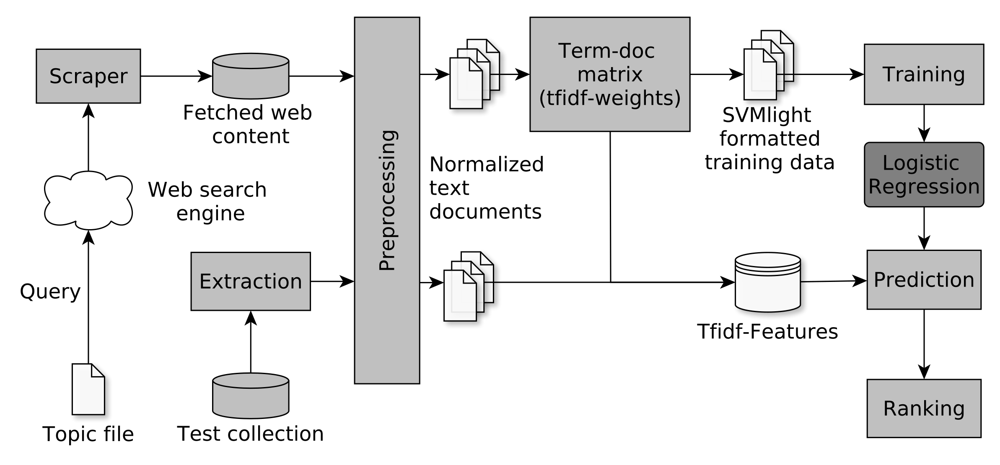

# Evaluating Elements of Web-based Data Enrichment for Pseudo-Relevance Feedback Retrieval

This repository accompanies our study in which we analyze pseudo-relevance classifiers based on the results of web search engines. By enriching topics with text data from  web search engine result pages and linked contents, we train topic-specific and cost-efficient classifiers that can be used to search test collections for relevant documents. Building up on attempts that were initially made at TREC Common Core 2018 by Grossman and Cormack (`uwmrg` and `uwmrgx`), we address the questions of system performance over time considering different search engines, queries and test collections. In order to avoid re-scraping web contents, we provide scraped artifacts in an external [Zenodo archive](https://zenodo.org/record/4105885). This archive also contains the final runs for the later evaluation.

#### Data resources

|Corpus | qrels | topics |
|---|---|---|
| [TREC Washington Post Corpus](https://trec.nist.gov/data/wapost/) | [Core18](https://trec.nist.gov/data/core/qrels2018.txt)| [Core18](https://trec.nist.gov/data/core/topics2018.txt)|
| [New York Times Annotated Corpus](https://catalog.ldc.upenn.edu/LDC2008T19)| [Core17](https://trec.nist.gov/data/core/qrels.txt)| [Core17](https://trec.nist.gov/data/core/core_nist.txt)|
| [The AQUAINT Corpus of English News Text](https://catalog.ldc.upenn.edu/LDC2002T31)| [Robust05](https://trec.nist.gov/data/robust/05/TREC2005.qrels.txt)| [Robust05](https://trec.nist.gov/data/robust/05/05.50.topics.txt)|
| [TREC disks 4 and 5](https://trec.nist.gov/data/cd45/index.html)| [Robust04](https://trec.nist.gov/data/robust/qrels.robust2004.txt)| [Robust04](https://trec.nist.gov/data/robust/04.testset.gz)|

#### Setup:

- Install requirements:
```
pip install -r requirements.txt
```

- Install [trec_eval](https://github.com/usnistgov/trec_eval):
```
git clone https://github.com/usnistgov/trec_eval.git && make -C trec_eval
```

- Configure `conf/path.py` in order to set path to test collection data and make sure the directory complies with the [directory tree](https://github.com/breuert/uwmrg-repro/tree/master/tree).

- Configure `conf/settings.py` in order to specify run

#### Run in advance in order to prepare data from newswire test collections. This needs to be done only once.

`prep_wapo.py` <br>
Will extract documents from Washington Post test collection (Core18).

`prep_nyt.py` <br>
Will extract documents New York Times test collection (Core17).

`prep_rob05.py` <br>
Will extract documents from AQUAINT test collection (Robust05).

`prep_rob04.py` <br>
Will extract documents TREC Disks 4 & 5 (Robust04).

`prep_topics.py` <br>
Run this script to add closing tags to the topics files. In order to read contents from topic files, we rely on Beautifulsoup. If closing tags are missing, values will not be read out properly.

#### Workflow


#### Order of execution
Depending on the run, the following files have to be run from the corresponding directory in the respective order.

1. `scrape.py` <br>
Scrapes webpages. (Alternatively use `dump.py` and `parse.py`)
<br>cmd: `python -m uwmrg.scrape`

2. `vectorize.py` <br>
Generates TfidfVectorizer from scraped webpages / makes term-doc-matrix.
<br>cmd: `python -m uwmrg.vectorize`

3. `prep_train.py` <br>
Prepares training data from scraped webpages based on tfidf-features derived from term-doc-matrix.
<br>cmd: `python -m uwmrg.prep_train`

4. `prep_test.py` <br>
Prepares tfidf-features for test corpus.
<br>cmd: `python -m uwmrg.prep_test`

5. `rank.py` <br>
Training of logistic regression classifiers. Ranking of tfidf-features of test corpus.
<br>cmd: `python -m uwmrg.rank`

6. `evaluate.py` <br>
Final evaluation with `trec_eval`.
<br>cmd: `python -m uwmrg.evaluate`


#### Evaluations

The underlying evaluation scripts of the tables and figures reported in our paper can be found in the directory `eval/`. To re-run the evaluations the data has to be downloaded from the [Zenodo archive](https://zenodo.org/record/4105885). The extracted folders `runs/`, `scrape/` and `time-series` should be placed in the subdirectory `eval/data/`. All our evaluations are conducted with [`repro_eval`](https://github.com/irgroup/repro_eval).
